  <samp>
    <a href="https://aiwan.run">me</a> .
    <a href="https://blog.aiwan.run">blog</a> .
    <a href="https://v.aiwan.run">v</a> .
    <a href="https://tools.aiwan.run">tools</a> .
    <a href="https://space.bilibili.com/174865648">bilibili</a>
  </samp>

  

|  |  |
| :------------------------------------------------------------: | :------------------------------------------------------------: |
|  |  |
|||

